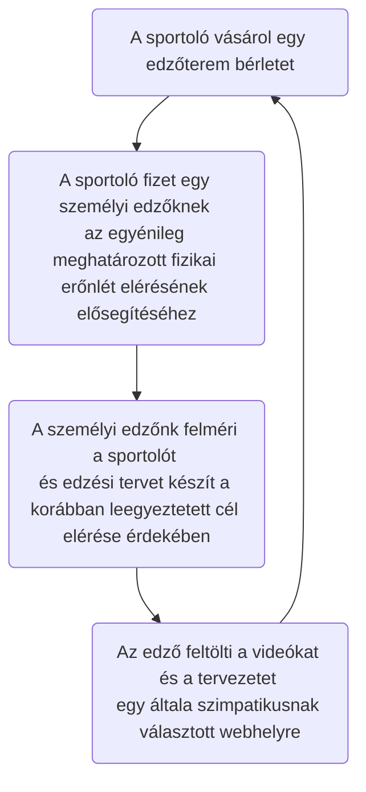
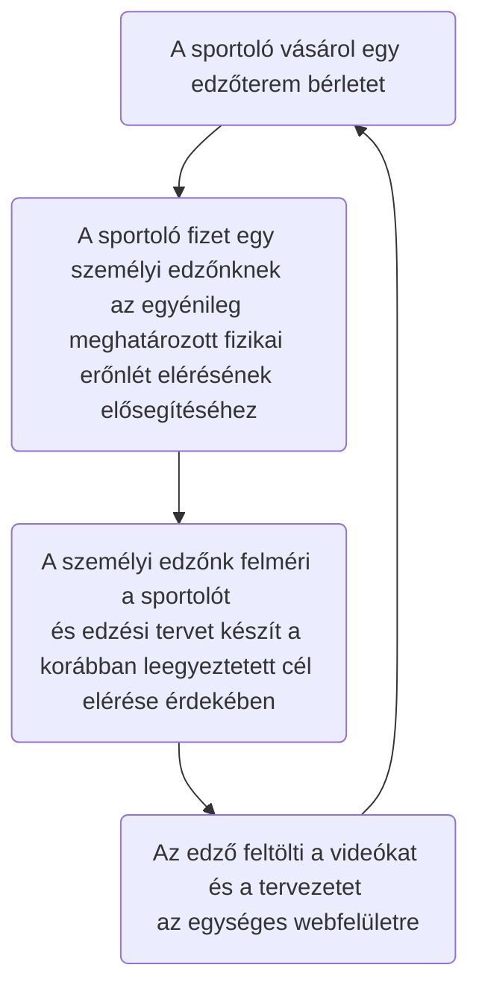

# Funkcionális Specifikáció

### 1. A rendszer céljai
Egységes weboldal elkészítése a sportolók és edzők számára a file-ok megosztásához.
### 2. Jelenlegi helyzet leírása
Az edzéstervek és videók különböző weboldalakra és alkalmazásokra vannak feltöltve.

A sportolók vagy nem találják meg a korábban átküldött linkeket, vagy a megadott weboldalakon idő előtt eltűnnek a file-ok.
### 3. Vágyálom rendszer leírása
Fontosabb szempontok:
 - Weboldal létrehozása (Laravel)
 - Regisztráció / Bejelentkező funkció
 - Különböző jogosultságok a sportolóknak és az edzőknek
 - File-ok feltöltésének és szerkesztésének lehetősége (Edzéstervek, videók)

### 3. Jelenlegi üzleti folyamatok

### 4. Igényelt üzleti folyamatok

### 5. Követelménylista 

ID|Verzió|Név|Kifejtés
--|------|---|--------
K01|V1.0|Bejelentkezési felület|Bejelentkezés email cím és jelszó megadásával
K02|V1.0|Kezdő weblaprész|Csak bejelentkezett felhasználóknak elérhető felület a tartalmak eléréséhez
K03|V1.0|Különböző jogosultságok|Eltérő jogosultságok biztosítása az edzőknek és a sportolóknak a tartalom módosítására
