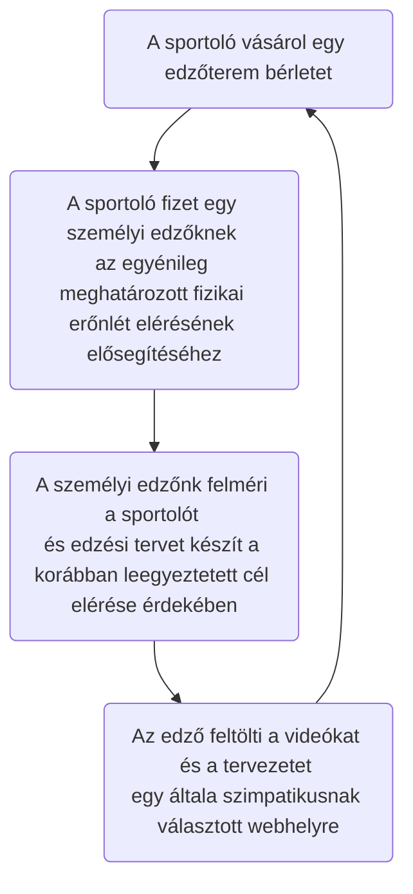
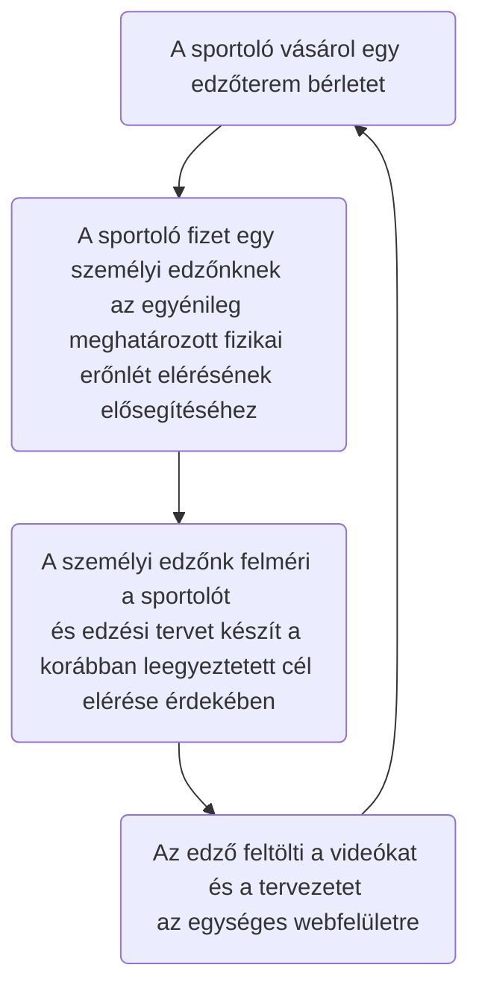

# Funkcionális Specifikáció

### 1. A rendszer céljai
Egységes weboldal elkészítése amely központi adatbázisból lekérve azonosítja a tagok hozzáférési jogosultságát,illetve az edzőterembe járó tagok egyébb igyényeit ki tudja elégíteni(informálni). 
A tulajdonos a központi adatbázison keresztül egy komplexebb képet kap tag létszámról, illetve a napi díjat fizető vendégek számáról. 
A tulajdonos távolabbi célja a rendszerrel, hogy kevesebb személyi edzőt alkalmazzon, hiszen az edzéshez szükséges információ erről a weboldalról elérhető. 
A tagok minden edzőtermet tudják használni, ne csak ott ahol bérletet vásároltak. 
### 2. Jelenlegi helyzet leírása

A jelenlegi helyzet rész a Követelmény Specifikációban van részletesen kidolgozva

### 3. Vágyálom rendszer leírása
Fontosabb szempontok:
 - Weboldal létrehozása (Laravel)
 - Regisztráció / Bejelentkező funkció
 - Különböző jogosultságok a sportolóknak és az edzőknek
 - File-ok feltöltésének és szerkesztésének lehetősége (Edzéstervek, videók)
 - béla

### 3. Jelenlegi üzleti folyamatok

### 4. Igényelt üzleti folyamatok

### 5. Követelménylista 

ID|Verzió|Név|Kifejtés
--|------|---|--------
K01|V1.0|Bejelentkezési felület|Bejelentkezés email cím és jelszó megadásával
K02|V1.0|Kezdő weblaprész|Csak bejelentkezett felhasználóknak elérhető felület a tartalmak eléréséhez
K03|V1.0|Különböző jogosultságok|Eltérő jogosultságok biztosítása az edzőknek és a sportolóknak a tartalom módosítására
