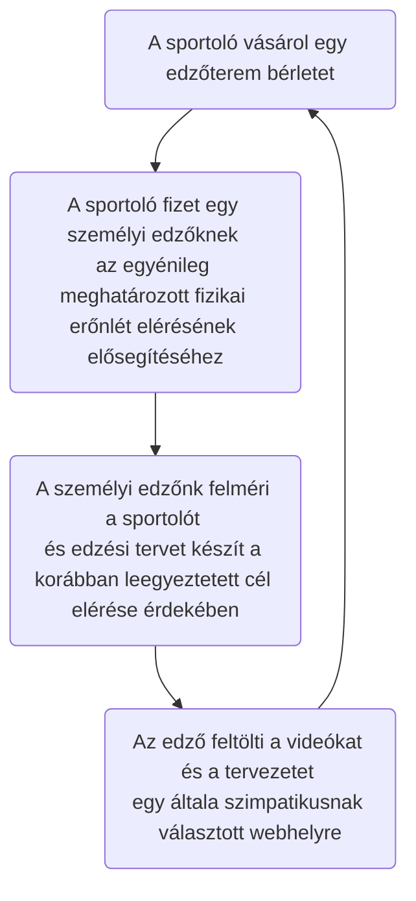
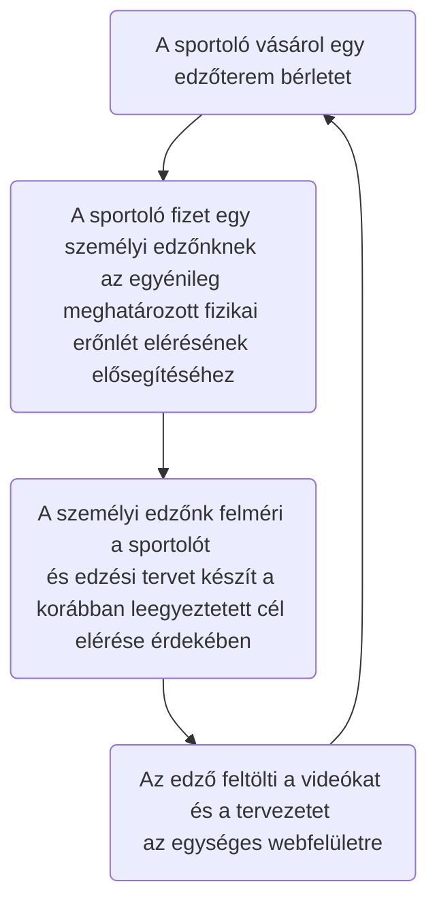

# Követelmény specifikáció

## 1. Jelenlegi helyzet

A vállalkozás Magyarországon edzőterem hálózatot üzemeltet.
Cégünket a partner 2021-ben kereste meg azzal a szándékkal, hogy készítsünk nekik egy olyan webfelületet, ahol az általuk elkészített edzésterveket, videóikat fel tudják tölteni.
Mivel a megrendelő foglalkoztat dietetikusokat is ezért a táplálkozás tudomány is szerepet kapna a webfelületen.
 Mivelaz elmúlt években többször be kellett zárni az edzőtermeket a vírushelyzettel kapcsolatos korlátozások miatt, ezért a tagok az edzéseiket otthon vagy más helyen végezték el sokszor segítség nélkül.
A megrendelő ezért egy weboldalt szeretne cégünkkelmegcsináltatni, ahol egy helyen számos igény tudna kielégíteni.
A korlátozások alatt az edzők különböző felületeken próbálták megosztani az edzésterveiket. A sportolóknak sokszor nem egyértelmű, hogy egy adott edzőtől mely linkeken elérhetőek a feltöltött videóik, illetve mely táplálkozási tanácsot és kitől fogadjanak el.

## 2. Megrendelői vízió (vágyálom)

A megrendelő a jelenlegi weboldallal az a célja, hogy a vállalkozásának a szolgáltatási színvonalát javítsa, illetve az általa foglakoztatott személyi edzők számát redukálja, mert az élő munkára rakódó közteher évről évre nő és ezáltal szeretné a költségeit csökkenteni, optimalizálni.
A bejelentkezés után a felhasználó rögtön egy igényes webfelülettel találkozna. 3 navigációs lehetősséggel.

  •	Videók

  •	Edzéstervek

  •	Diéták

A rendszergazdai oldalról viszont lehetőséget biztosítanák videók, képek feltöltésére és módosítására.
Mivel a megrendelő számos edzőtermet üzemeltet, így szeretne egy központi adatbázist is létrehozni azzal a szándékkal, hogy 
aki érvényes bérlettel rendelkezik ne csak ott tudjon edzeni ahol kiváltotta a bérletet, hanem az összes edzőtermeiben.

## 3. Jelenlegi üzleti folyamatok

3.1	Az edzőterembe járó tagsági díjat fizető tagok adatainak a nyilvántartása 
 &nbsp; 3.1.1.	Új tag regisztrálása: A helyi recepciós végzi el a munkafolyamatot.  => lokális adatbázisba való adatfelvitel 
 &nbsp; 3.1.2.	Tagsági díj megszüntetése: A lejárt tagsági díj lejártával a recepciós deaktiválja a sorszámát => lokális adatbázisban átállítja a jogosultságát. 
 &nbsp; 3.1.3. Napi díjat fizető sportoló regisztrálása: A recepciós végzi el ezt a munkafolyamatot=>  Minimális regisztráció elvégzése 
3.2.	Személyi Edző igénylése 
&nbsp; 3.2.1.	telefonos foglalás esetén: recepciós végzi el ezt a munkafolyamatot => a kívánt személyi edző időpontjának a foglalása 
&nbsp; 3.2.2.	személyes foglalás esetén: recepciós végzi el ezt a munkafolyamatot => a kívánt személyi edző időpontjának a foglalása 
3.3.	Szoláriumi Hely foglalása 
&nbsp;3.3.1.	telefonos foglalás esetén: recepciós foglalja az időpontot => lokális táblázatban foglalja az időpontot 
&nbsp;3.3.2.	személyes foglalás esetén: recepciós foglalja az időpontot => lokális táblázatban foglalja az időpontot 

 
 

## 4. Igényelt üzleti folyamatok

4.1.	Az edzőterembe járó tagsági díjat fizető tagok adatainak a nyilvántartása. 
&nbsp;4.1.1.	Új tag regisztrálása: A helyi recepciós végzi el a munkafolyamatot.  => központi adatbázisba való adatfelvitel. 
&nbsp;4.1.2.	Tagsági díj megszüntetése: A lejárt tagsági díj lejártával a recepciós deaktiválja a sorszámát => központi adatbázisban átállítja a jogosultságát. 
&nbsp;4.1.3.	Napi díjat fizető sportoló regisztrálása: A recepciós végzi el ezt a munkafolyamatot=>  Minimális regisztráció elvégzése=> központi adatbázisba regisztrálja => tulajdonos szeretné látni, hogy mennyi a napi díjat fizető vendég stb... 

## 5. A rendszerre vonatkozó szabályok
 - General Data Protection Regulation (Általános adatvédelmi rendelet)

## 6. Követelménylista

ID|Verzió|Név|Kifejtés
--|------|---|--------
K01|V1.0|Bejelentkezési felület|Bejelentkezés email cím és jelszó megadásával
K02|V1.0|Kezdő weblaprész|Csak bejelentkezett felhasználóknak elérhető felület a tartalmak eléréséhez
K03|V1.0|Különböző jogosultságok|Eltérő jogosultságok biztosítása az edzőknek és a sportolóknak a tartalom módosítására
