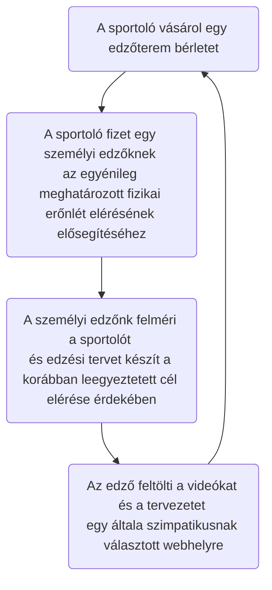
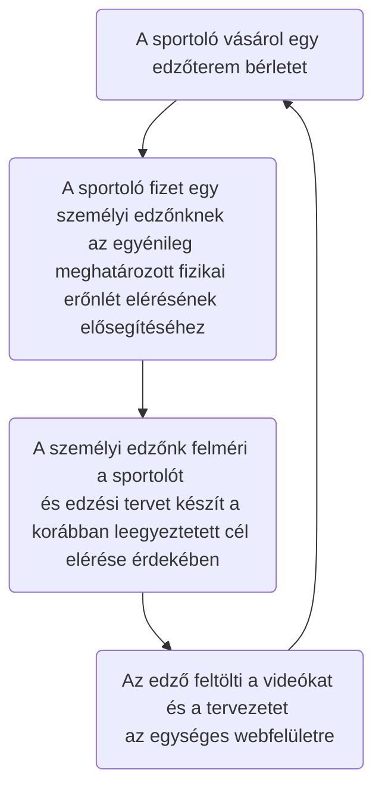

# Követelmény specifikáció

## 1. Jelenlegi helyzet

A vállalkozás Magyarországon edzőterem hálózatot üzemeltet.
Cégünket a partner 2021-ben kereste meg azzal a szándékkal, hogy készítsünk nekik egy olyan webfelületet, ahol az általuk elkészített edzésterveket, videóikat fel tudják tölteni.
Mivel a megrendelő foglalkoztat dietetikusokat is ezért a táplálkozás tudomány is szerepet kapna a webfelületen.

## 2. Megrendelői vízió (vágyálom)
Fő víziónk egy olyan weboldal létrehozása, ahol az edzőterem használatára jogosultak hozzáférnek különböző edzési módszerekhez. Egységes felületet szeretnénk biztosítani az edzéstervek eléréséhez.

Áttekinthető weboldalt szeretnénk, melyben a tervek könnyedén elérhetőek és szerkeszthetőek. Fontosnak tartjuk, hogy legyen regisztrációs felület az oldal eléréséhez. 

Az edzőknek szükséges, hogy legyen jogosultsága az oldal tartalmának módosításához. A videók és tervezek bővítésére gyakran kerülhet sor, ugyanis minden ember más edzéstervet igényel. Ez függhet a kortól, súlytól és aktuális fizikai állapottól, valamint a sportolás céljától. 

## 3. Jelenlegi üzleti folyamatok

## 4. Igényelt üzleti folyamatok

## 5. A rendszerre vonatkozó szabályok
 - General Data Protection Regulation (Általános adatvédelmi rendelet)

## 6. Követelménylista

ID|Verzió|Név|Kifejtés
--|------|---|--------
K01|V1.0|Bejelentkezési felület|Bejelentkezés email cím és jelszó megadásával
K02|V1.0|Kezdő weblaprész|Csak bejelentkezett felhasználóknak elérhető felület a tartalmak eléréséhez
K03|V1.0|Különböző jogosultságok|Eltérő jogosultságok biztosítása az edzőknek és a sportolóknak a tartalom módosítására
