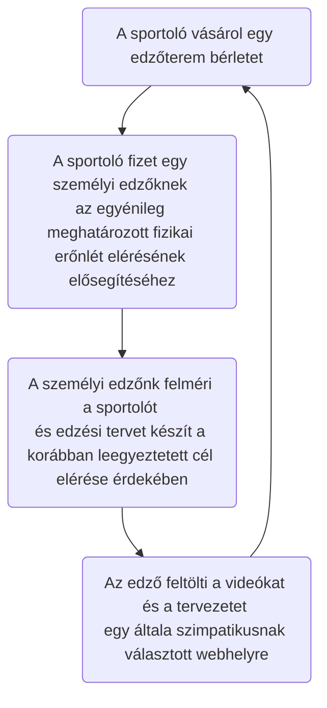
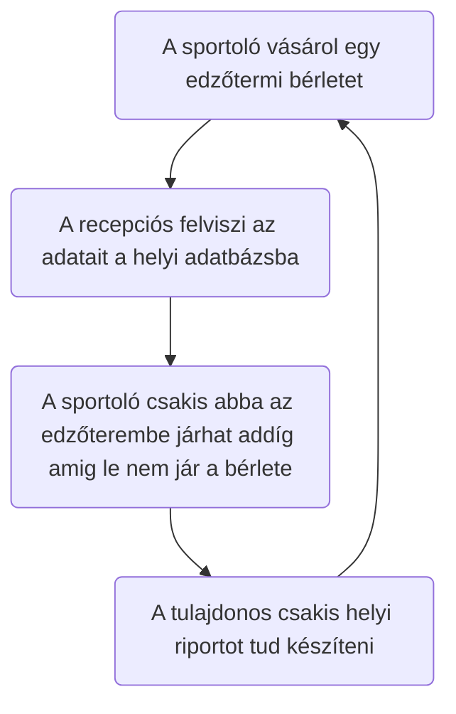
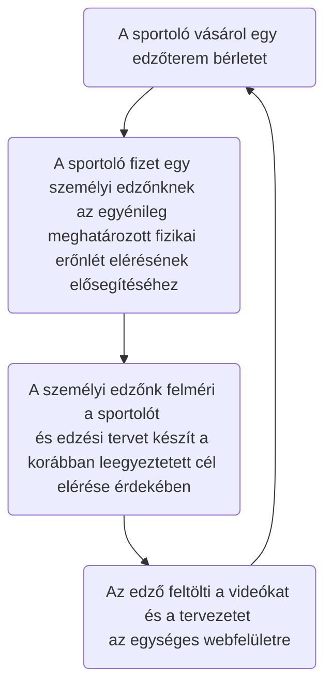
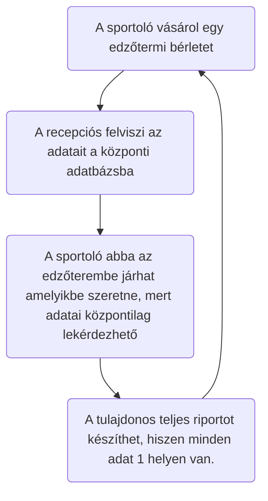

# Rendszerspecifikáció

## 1. Rendszer célja

Egy olyan weboldal és hozzá kapcsolódó adatbázis elkészítése, amely alkalmas a követelmény specifikációban leírt igények kielégítésére. 
A cégünk kizárólag a weboldal és a hozzá kapcsolódó adatbázist készíti el, a weboldalon későbbiekben megjelenő tartalom elkészítése nem a projekt része. 

## 2. Projekt terv

### 2.1 Humán erőforrás

- 2 fő junior programozó // felelőségi kör kidolgozása/megbeszélés
- 1 fő senior programozó
- 1 fő projekt manager
- 1 fő Scrum master

###  2.2 Ütemterv

ID|Tevékenység|Időtartam-tól|Időtartam-ig|Függőség
--|------|---|--------|------
1|Igény Elemzés|2021.03.16|2021.03.17||
2|Rendszerjavaslat|2021.03.17|2021.03.18||
3|Rendszerspecifikáció|2021.03.18|2021.03.18||
4|Logikai és fizikai tervezés|2021.03.18|2021.03.19||
5|Implementáció|2021.03.19|2021.03.20||
6|Tesztelés|2021.03.20|2021.03.22||
7|Rendszerátadás és bevezetés|2021.03.22|2021.03.23||
8|Projektzárás||2021.03.23||

- Laravel keretrendszer alkalmazása
- Regisztráció / bejelentkezési lehetőség
- Adatbázis használata

## 3.Üzleti folyamatok modellje

Üzleti szereplők
* spotoló
* személyi edző
* alkalmazottak
* tulajdonos

Üzleti események:
* napi jegy vásárlás
* bérlet vásárlás
* regisztráció
* személyi edző idégnylése

### 3.1 Jelenlegi üzleti folyamatok

Felhasználói szemszögből:

Adatbázis szemszögből:

### 3.2 Igényelt üzleti folyamatok

Felhasználói szemszögből

Adatbázis szemszögből:

## 4.Követelménylista:

Itt azon funkciók vannak felsorolva, amely el is fog készülni.

ID|Verzió|Név|Kifejtés
--|------|---|--------
K01|V1.0|Bejelentkezési felület|Bejelentkezés email cím és jelszó megadásával
K02|V1.0|Kezdő weblaprész|Csak bejelentkezett felhasználóknak elérhető felület a tartalmak eléréséhez
K03|V1.0|Különböző jogosultságok|Eltérő jogosultságok biztosítása az edzőknek és a sportolóknak a tartalom módosítására
K04|V1.0|Központi adatbázis létrehozása| Összes tag adatainak a tárolása
K05|V1.0|Regisztrációs felület létrehozása|Itt lehet a tagokat felvinni az adatbázisba
K06|V1.0|Jogosultsági felület létrehozása|Itt lehet a tagok egyébb jogosultságait módosítani az adatbázisban
K07|V1.0|Feltölthetőségi funkció|Itt lehet a weboldalra videót és képet feltölteni

### 4.1 Törvényi Előírások, szabványok

  *  2013 évi L. törvény az állami és önkormányzati szervek elektronikus információbiztonságáról 1. §  
  *  A weboldal minden részének megfeleltetése a W3C szabványnak  

## 5 Funkcionális Specifikációk

### 5.1 Funkcionális Terv

### 5.2 Fizikai Környezet

## Bejelentkezett felhasználó által elérhető funkciók
- Tartalmak elérése
- File feltöltés / letöltés 
- Saját profil adatainak szerkesztése

