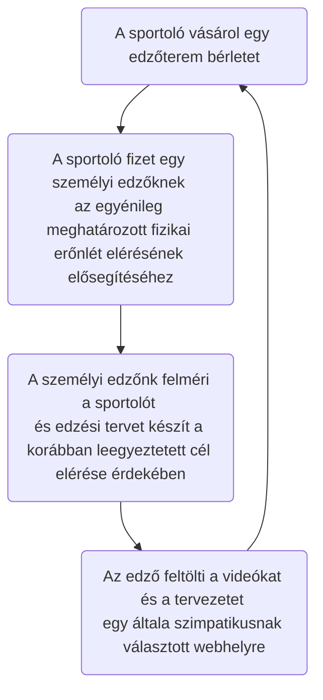
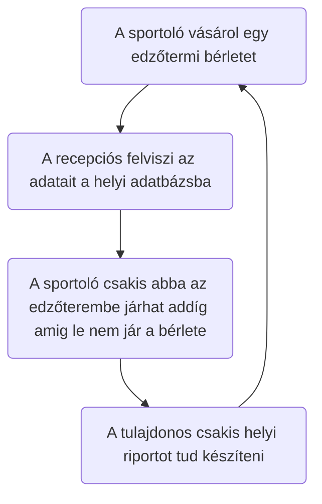
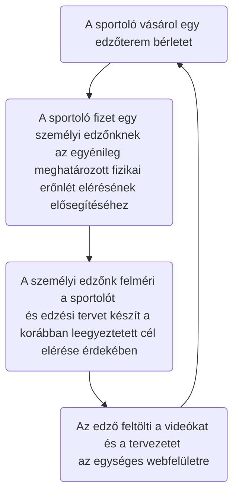
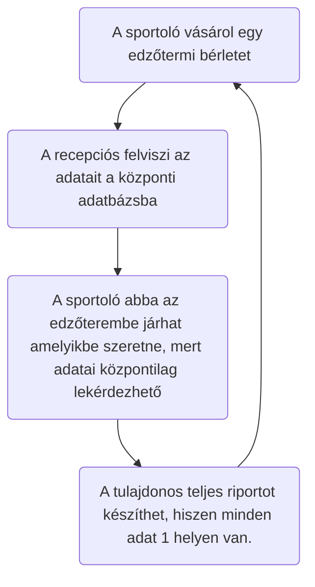
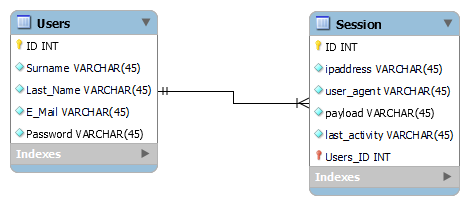
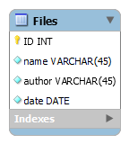
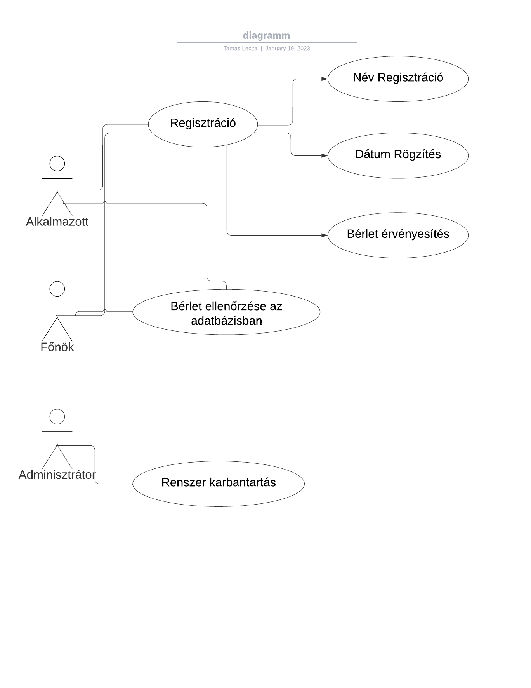

# Rendszerspecifikáció

## 1. Rendszer célja

Egy olyan weboldal és hozzá kapcsolódó adatbázis elkészítése, amely alkalmas a követelmény specifikációban leírt igények kielégítésére. 
A cégünk kizárólag a weboldal és a hozzá kapcsolódó adatbázist készíti el, a weboldalon későbbiekben megjelenő tartalom elkészítése nem a projekt része. 

## 2. Projekt terv
### 2.1 Projekt szerepkörök, felelőségek

A scrum master feladata, hogy a folyamatosan kommunikáljon a csapat tagjaival, illetve a sprint során 
átlendítse a nehézségeken a projekten dolgozókat.

### 2.2 Projekt munkások és felelőségeik

### 2.3 Humán erőforrás

- 2 fő junior programozó // felelőségi kör kidolgozása/megbeszélés
- 1 fő senior programozó
- 1 fő projekt manager
- 1 fő Scrum master

###  2.4 Ütemterv

ID|Tevékenység|Időtartam-tól|Időtartam-ig|Függőség
--|------|---|--------|------
1|Igény Elemzés|2021.03.16|2021.03.17||
2|Rendszerjavaslat|2021.03.17|2021.03.18||
3|Rendszerspecifikáció|2021.03.18|2021.03.18||
4|Logikai és fizikai tervezés|2021.03.18|2021.03.19||
5|Implementáció|2021.03.19|2021.03.20||
6|Tesztelés|2021.03.20|2021.03.22||
7|Rendszerátadás és bevezetés|2021.03.22|2021.03.23||
8|Projektzárás||2021.03.23||

- Laravel keretrendszer alkalmazása
- Regisztráció / bejelentkezési lehetőség
- Adatbázis használata

## 3.Üzleti folyamatok modellje

Üzleti szereplők
* spotoló
* személyi edző
* alkalmazottak
* tulajdonos

Üzleti események:
* napi jegy vásárlás
* bérlet vásárlás
* regisztráció
* személyi edző idégnylése

### 3.1 Jelenlegi üzleti folyamatok

Felhasználói szemszögből:

Adatbázis szemszögből:

### 3.2 Igényelt üzleti folyamatok

Felhasználói szemszögből

Adatbázis szemszögből:

## 4.Követelménylista:

Itt azon funkciók vannak felsorolva, amely el is fog készülni.

ID|Verzió|Név|Kifejtés
--|------|---|--------
K01|V1.0|Bejelentkezési felület|Bejelentkezés email cím és jelszó megadásával
K02|V1.0|Kezdő weblaprész|Csak bejelentkezett felhasználóknak elérhető felület a tartalmak eléréséhez
K03|V1.0|Különböző jogosultságok|Eltérő jogosultságok biztosítása az edzőknek és a sportolóknak a tartalom módosítására
K04|V1.0|Központi adatbázis létrehozása| Összes tag adatainak a tárolása
K05|V1.0|Regisztrációs felület létrehozása|Itt lehet a tagokat felvinni az adatbázisba
K06|V1.0|Jogosultsági felület létrehozása|Itt lehet a tagok egyébb jogosultságait módosítani az adatbázisban
K07|V1.0|Feltölthetőségi funkció|Itt lehet a weboldalra videót és képet feltölteni

### 4.1 Törvényi Előírások, szabványok

  *  2013 évi L. törvény az állami és önkormányzati szervek elektronikus információbiztonságáról 1. §  
  *  A weboldal minden részének megfeleltetése a W3C szabványnak  
  
## Képernyőtervek
A képernyőtervek a figma software-el készülnek.

Főbb oldalak:
- **kezdolap**, amely minden felhasználó számára először jelenik meg.  

- **belépés / regisztáció**. A kezdőlapon a kiválasztott gomb megnyomását követően érhetjük el.

- **dashboard**, a már regisztrációval rendelkező és belépett felhasználóknak elérhető. Innen tudunk a weblap lényegesebb részeibe továbblépni(Feltöltés, dokumentumok letöltése, file-ok, videók)  

- **dokumentumok**, file-ok felsorolva nevük és szerzőjük alapján elérhetőek és letölthetőek.   

- **upload**, file-ok feltöltése az adatbázisba.  
### Forgatókönyvek
A weboldal megnyitásával megjelenik a kezdőoldal. Ezen a felületen a cég főbb emblémái jelennek meg és egy bejelentkezés valamint regisztrációs gomb.
Az oldal minden egyéb funkciója a belépést követően elérhető alábbiak szerint:
* Felhasználói profil beállítások
* Dokumentumok, edzéstervek
* Edzéssel, étrendel kapcsolatos videók
* File feltöltés lehetősége

A felhasználói profil beállításokban lehetőség van:
* Felhasználónév módosítása
* Email cím módosítása
* Kétfaktoros hitelesítés
* Felhasználói fiók törlése

A dokumentumok, edzéstervek weblaprész alatt lehetőség van:
* Szűrni szerző, feltöltési időpont alapján
* Keresni szerzői név és dokumentum megnevezés alapján
* Dokumentumok letöltése

Videók weblaprész alatt lehetőség van:
* Szűrni szerző, feltöltési időpont alapján
* Keresni videó cím alapján

## Implementációs terv
A felhasználói felület HTML, CSS, JavaScript és Laravel blade sablonrendszeri technológiák felhasználásával készülnek. 
Mysql adabázist használunk az adatok tárolására. Visual studio code használata implementáláshoz.

## Adatbázis terv
Táblák:
- Felhasználó
	- táblanév: users
	- mező nevek:
        - ID
        - name
        - email
        - password
        
- Browser sessions
	- táblanév: session
	- mező nevek:
        - ID
        - user_id
        - ipaddress
        - user_agent
        - payload
        - last activity

- Dokumentumok
	- táblanév: files
	- mező nevek:
        - ID
        - name
        - author
        - date

### Felhasználói adatbázis modell

### A fájlfeltöltéshez kapcsolódó adatbázis modell

### Tesztterv
### A teszteléshez 8 kisebb csoportra osztjuk a feladatokat

1. Dashboard weblaprész
- Innen tudjuk elérni a weboldal főbb részeit. A gombok használata során teszteljük a helyes navigálást a weblaprészek között.

2. File feltöltő weblaprész
- Gombok helyes működése és a feltöltés megfelelő működésének tesztelése

3. Dokumentumok weblaprész
- Letöltés gomb működése, dokumentumok megjelenése.

4. Kétfaktoros authentikáció
- Helyes jelszó megadást követően meg kell jelennie egy qr kódnak. Amit a google authenticator telefonos applikációnak el kell fogadnia. Ezt követően
a telefonos applikáción megjelenő kódot be kell írni a "code" sorba. Csak helyes kód megadása esetén mehet végbe a párosítás.

5. Felhasználó bejelentkezés és regisztráció
- Regisztráció során az e-mail címre olyan megkötés vonatkozik, hogy a " @ " karakternek kötelezően szerepelnie kell benne. Ellelkező esetben a regisztráció sikertelen.
Jelszó megadásához minimum 8 karakter szükséges.

6. Felhasználó adatainak megváltoztatása
- A felhasználó megváltoztathatja a felhasználónevét nagyobb megkötések nélkül. 
Szerepelhet benne kis és nagybetű, speciális karakter, számok. 1től 32 karakterig is terjedhet.

7. Felhasználói fiók törlése
- Törlés esetén meg kell jelenni egy ablaknak, amely bekéri a jelszavunkat. Helyes jelszó megadást követően törlődhet a regisztrált profil.

8. Bejelentkezett eszközök kiléptetése
- Kiléptetés esetén szintén helyes jelszó megadása szükséges és a folyamat ezt követően futhat le.

### 1. Dashboard weblaprész teszt

|Lépés|Feladat|
|-----|-------|
|1.   | Weboldal megjelenik 
|2.   | Kettő "nézd meg gomb" és egy "feltöltés" gomb kattintható 
|2.1  | Dokumentumok "Nézd meg" gomja átnavigál bennünket a dokumentumok weblaprészre 
|2.2  | FIT video "Nézd meg" gomja átnavigál bennünket egy workout playlistre 
|2.3  | "feltöltés" gomb átnavigál bennünet a dokumentum feltöltő oldalra 
|3.   | Jobb felső sarokban a nevünkre kattintva felugrik egy ablak "Profile" és "Log out" lehetőségekkel
|3.1  | "profile" gombra kattintva megjelenik a profil beállítások weblaprész 
|3.2  | "Log out" gombra kattintva kiléptet profilunkból és visszatérünk a bejelentkezés / regisztráció oldalra 
|3.4  | Kijelentkezést követően "Login" , "register" gomb kattintható, megjeleníti a belépés / regisztráció weblaprészt 

### 2. File feltöltés teszt
|Lépés|Feladat|
|-----|-------|
|1.   | Weboldal megjelenik 
|2.   | "Fájl kiválasztása" és "Kész" gomb kattintható 
|2.1. | "Fájl kiválasztása" gomb megnyomása után tallózhatunk a saját file-jaink között 
|3.   | Tallózást követően a gomb mellett megjelenik a kiválasztott file neve 
|3.1  | "Kész" gombra kattintva kiírásra kerül a feltöltött titkosított file név a weblapon
|3.2  | Feltöltést követően a file eltárolódik a storage --> app --> docs mappában

### 3. Dokumentumok weblaprész teszt

|Lépés|Feladat|
|-----|-------|
|1.   | Weboldal megjelenik 
|2.   | Dokumentum neveket, szerzőket megjeleníti
|3.   | Dokumentumok melletti letöltés gomb kattintható
|4.   | "Letöltés" gombra kattintva letölti a megadott dokumentumot 

### 4. Kétfaktoros authentikáció
|Lépés|Feladat|
|-----|-------|
|1.   | Enable-gomb megnyomása után megjelenik egy ablak, ahová jelszavunkat szükséges megadni.
|1.2  | Helytelen jelszó megadása esetén hibaüzenet jelenik meg: "This password does not match our records." 
|1.3  | Helyes jelszó megadása esetén egy beolvasandó QR kód jelenik meg. 
|1.4  | Google authenticator applikáción a qr kód beolvasása után egy kódot kapunk 
|1.4  | A megkapott kódot ha beírjuk helyesen a weboldal "Code" mezőjébe, akkor recovery kódokat szükséges látni valamint a disable gombot 
|1.5  | A megkapott kód helytelen rögzítése esetén hibaüzenetet kapunk: "The provided two factor authentication code was invalid."

### 5. Felhasználó bejelentkezés regisztráció teszt
|Lépés| Feladat |
| --- | ------- | 
|1.   | Weboldal megjelenik 
|2.   | Login gombra kattintva megjelenik a bejelentkező oldal 
|3.   | Helyes adatok megadását követően Login gombra kattintva megjelenik a kezdőoldal 
|3.1  | Helytelen adatok megadásával a Login gombra kattintva hibaüzenet jelenik meg. " Whoops! Something went wrong. " 
|3.2  | Elfelejtett jelszó gombra kattintva password reset e-mailt küld a felhasználónak " 
|4.   | Register gombra kattintva megjelenik a regisztrációhoz szükséges weboldal 
|4.1  | Helytelen e-mail cím kitöltése esetén hibaüzenet jelenik meg: "Kérjük írjon egy '@' karaktert e-mail címébe" 
|4.2  | Rövid jelszó megadása esetén hibaüzenet jelenik meg: "The password must be at least 8 characters." 

### 6. Felhasználó adatainak megváltoztatása teszt
|Lépés| Feladat 
| --- | ------- | 
|1.   | Profile-gombra kattintva megjelennek a felhasználóval kapcsolatos beállítási lehetőségek 
|2.   | Név és email sikeres megváltoztatása után "saved"-üzenet megjelenése a save-gomb mellett 
|2.1  | Helytelen e-mail cím kitöltése esetén hibaüzenet jelenik meg: "Kérjük írjon egy '@' karaktert e-mail címébe" 
|3.   | Jelszó megváltoztatása során ha rövid jelszót adunk meg "The password must be at least 8 characters."-üzenetet kapunk 
|3.1  | Jelszó megváltoztatása során ha nem azonos a kétszer megadott jelszó, akkor hibaüzenet jelenik meg: "The password confirmation does not match."

### 7. Felhasználói fiók törlése teszt
|Lépés| Feladat | 
| --- | ------- | 
|1.   | Delete account gomb megjelenik. 
|2.   | Delete account gomb megnyomására megjelenik egy ablak, ahová jelszavunkat szükséges megadni. 
|2.1  | Helytelen jelszó megadása esetén hibaüzenet jelenik meg: "This password does not match our records."  
|2.2  | Helyes jelszó megadást követően kiléptet minket és átnavigál a weboldal az index.php-ra 

### 8. Bejelentkezett felhasználók kiléptetése teszt
|Lépés| Feladat | 
| --- | ------- | 
|1.   | Log out gomb megjelenik.
|1.   | Log out other browser sessions-gomb megnyomása után megjelenik egy ablak, ahová jelszavunkat szükséges megadni.
|1.2  | Helytelen jelszó megadása esetén hibaüzenet jelenik meg: "This password does not match our records." 
|1.3  | Helyes jelszó megadása esetén minden session megszűnik a jelenleg használt eszközünkön kívül.
|1.4  | Helyes jelszó megadása esetén megjelenik egy "Done." Felirat a Log out other browser sessions-gomb mellett.

Amennyiben megfelelő eredményt kapunk, úgy a teszt jegyzőkönyben a feladat "success" eredmént kap, ellenkező esetben "failed" kimenetellel rögzítjük. Ezt követően a feljegyzett hibákat kijavítjuk és újabb teszteléseket végzünk.

## 5 Funkcionális Specifikációk

### 5.1 Funkcionális Terv

### 5.2 Fizikai Környezet

A megrendelt weboldal a Laravel 9 weboldalfejlesztői környezetbe fog elkészülni. 
Az elkészítendő weboldal platform független, így bármely internettel és webböngészővel rendelkező hardware-rel elérhető lesz. 
Az adatbázisba való regisztráláshoz, lekérdezéshez, módosításhoz illetve törléshez szükség lesz egy kliens alkalmazás fejlesztésére is, 
amely C# nyelven, Visual Studio szoftverfejlesztői környezetben fog elkészülni. 
Ennek az alkalmazásnak a futtatásához szükséges lesz valamely .net keretrendszerrel működő számítógép vagy laptop stb...

## Bejelentkezett felhasználó által elérhető funkciók
- Tartalmak elérése
- File feltöltés / letöltés 
- Saját profil adatainak szerkesztése

